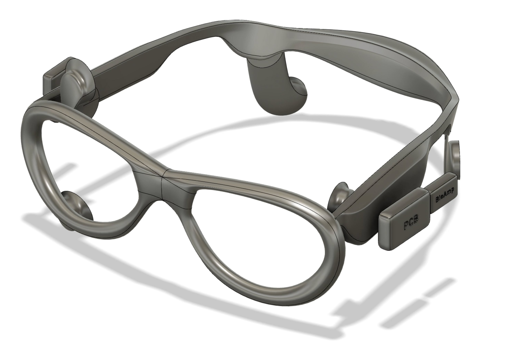

<p align="center">
  
</p>

# 👁️👁️ FocusTrack

> **EOG-based wearable for passive eye movement tracking as a biomarker for ADHD distraction.**

🏆 **Selected as 1 of 6 finalists from 40+ NYU Tandon capstone teams** — awarded **Greatest Social Impact** by an industry panel of judges.

📽️ [View Presentation](https://canva.link/1r4mbuxdwvg7awo) · 🔗 [LinkedIn Announcement](https://www.linkedin.com/posts/nyutandonschoolofengineering_nyutandonmade-ugcPost-7468778521675563008-BVer?utm_source=share&utm_medium=member_desktop&rcm=ACoAAEVdTVEBOwvyD5ErC1Rs4DFksatKHeYslE4)

---

## Overview

FocusTrack is a low-cost, wearable ADHD diagnostic prototype that uses **Electrooculography (EOG)** to passively capture and classify eye movement biomarkers associated with attention deficits. Rather than relying on expensive camera-based pupil tracking (often $10,000+) or invasive clinical testing, FocusTrack embeds sensing electronics directly into a custom 3D-printed glasses frame, enabling naturalistic, ambulatory data collection.

EOG signals are processed by an Arduino microcontroller to detect directional eye movements (left, right, up, down, and center fixation). These movement patterns — especially reflexive saccades and antisaccades — are well-documented in peer-reviewed literature as indicators of attentional control relevant to ADHD diagnosis.

---

## Key Features

- **Wearable form factor** — all components embedded in a 3D-printed glasses enclosure designed in Fusion 360
- **Real-time EOG signal processing** — moving average filtering, dynamic baseline calibration, and directional state classification on Arduino
- **Structured cognitive task battery** — fixation, prosaccade (Task 2), and antisaccade (Task 3) paradigms implemented in Python/Pygame
- **Synchronized data logging** — computer timestamp + Arduino timestamp logged to CSV for offline analysis
- **Non-invasive & discrete** — no cameras, no clinic required; designed for everyday home use

---

## Repository Structure

```
focustrack/
├── focustrack_final.ino      # Arduino firmware: EOG signal acquisition & classification
├── eog_logger.py             # Python serial logger: captures Arduino output to CSV
├── adhd_test.py              # Pygame task runner: calibration, fixation, saccade, antisaccade
├── session.csv               # Sample session output (task events + timestamps)
├── eog_command.txt           # Inter-process command file (calibration trigger)
└── README.md
```

---

## Cognitive Task Battery

The test protocol (`adhd_test.py`) runs three sequential tasks:

| Task | Description | Trials |
|------|-------------|--------|
| **Calibration** | Subject fixates on center dot; EOG baseline is established | 10 s |
| **Task 1 — Fixation** | Maintain gaze on center dot; measures baseline drift | 2 × 30 s |
| **Task 2 — Prosaccade** | Dot appears left or right; subject follows it as quickly as possible | 40 trials |
| **Practice Run** | Antisaccade practice with feedback | 5 trials |
| **Task 3 — Antisaccade** | Dot appears left or right; subject looks the **opposite** direction | 40 trials |

All task events are timestamped and written to `session.csv` for synchronization with EOG data.

---

## Hardware

| # | Part |
|---|------|
| 1 | ATmega328P microcontroller (Arduino Uno R3) |
| 2 | BioAmp EXG Pill signal chip |
| 3 | BioAmp cable |
| 4 | Electrode Gel |
| 5 | 3-pin connector |
| 6 | 500 mAh Battery |
| 7 | Glass frame (custom 3D-printed enclosure) |
| 8 | Skin Prep Gel |
| 9 | Wet wipes |
| 10 | Sensor Cable — Electrode Pads (3-connector) |

Electrodes are placed at the outer canthi and in each temples in standard EOG configuration. The BioAmp EXG Pill amplifies the biopotential signal before it reaches the Arduino's analog input pins.

<p align="center">
  
  <br/>
  <em>Fusion 360 render of the FocusTrack glasses enclosure with embedded BioAmp and PCB modules</em>
</p>

---

## Getting Started

### Prerequisites

- Arduino IDE (for uploading `focustrack_final.ino`)
- Python 3.x
- Dependencies: `pyserial`, `pygame`

```bash
pip install pyserial pygame
```

### 1. Flash the Arduino

Open `focustrack_final.ino` in the Arduino IDE and upload to your Arduino Uno R3.

### 2. Update the Serial Port

In `eog_logger.py`, update the `SERIAL_PORT` variable to match your system:

```python
SERIAL_PORT = "/dev/cu.usbmodem14401"  # macOS example
# SERIAL_PORT = "COM3"                  # Windows example
# SERIAL_PORT = "/dev/ttyUSB0"          # Linux example
```

### 3. Run the Experiment

```bash
python adhd_test.py
```

The script will automatically launch the EOG logger as a background thread, display the task UI in fullscreen, and write all events to `session.csv`.

---

## Output Format

`session.csv` logs two types of rows:

**Task events** (source: `TASK`)
```
source, event, computer_time, experiment_time
TASK, task2_start, 2025-03-10 14:32:01.123456 EDT, 45.231
TASK, target_left, 2025-03-10 14:32:03.456789 EDT, 47.454
```

**EOG events** (source: `EVENT`, written by `eog_logger.py` to `eye_movements.csv`)
```
computer_time, arduino_time_ms, posX, posY, state, rawH, rawV, deltaH, deltaV
```

---

## Outcomes & Next Steps

EOG signals successfully capture directional eye movement (left/right detection), which is foundational to analyzing ADHD-associated distraction patterns.

**Planned next steps:**
- Assemble all components into a compact, wearable glasses frame
- Conduct a large-scale study to increase sample size and identify statistically significant trends
- Refine signal quality by implementing noise elimination using the ArduinoFFT library
- Collaborate with clinical neuropsychologists to validate diagnostic relevance
- Pursue a randomized clinical trial partnership

---

## Team

| Name | Role |
|------|------|
| **Marina McMahon** | ADHD statistics & Research & Co-Task code |
| **Theodore Hua** | Design (Hardware-prototyping, 3D model, logo, animation) |
| **Jane Manalu** | Product Managing & Co-Task code & Research & Testing |
| **Vincent Sugianto** | Main firmware & hardware integration |
| **Bhavya Sanjana** | Future implementation & product impact |

*NYU Tandon School of Engineering — Capstone Design Project*

---

## License

This project was developed as an academic capstone. Please contact the team before reusing or building upon this work.
